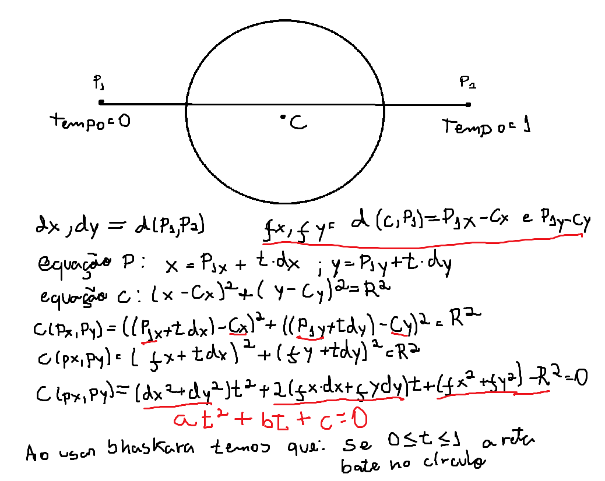
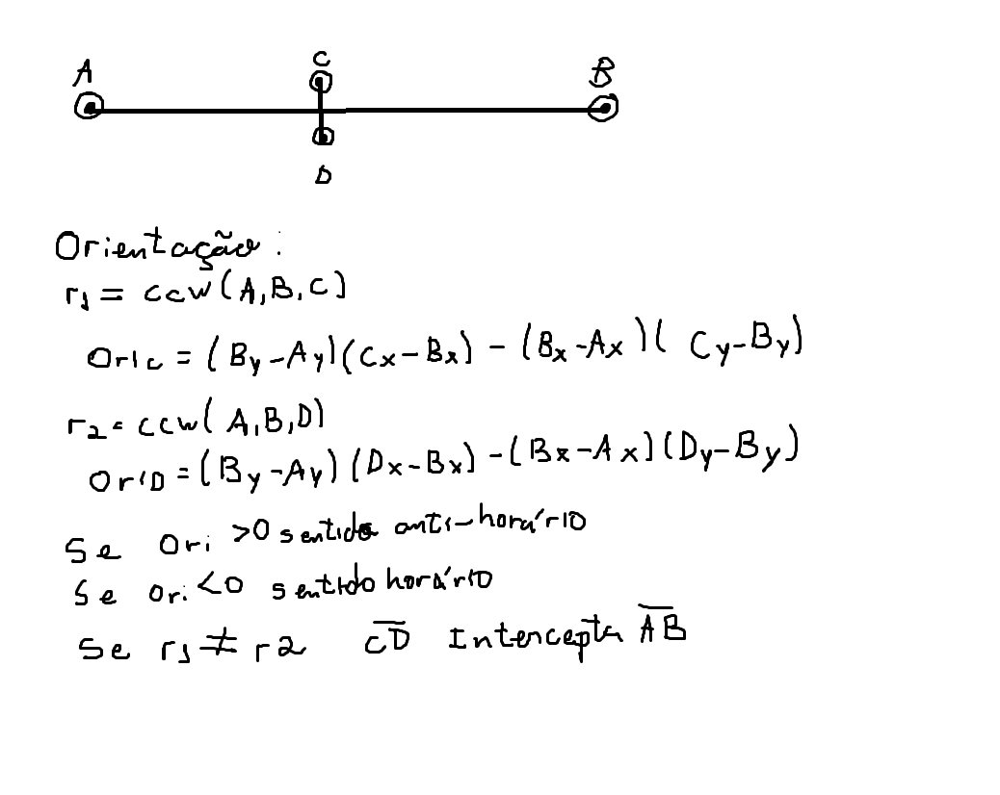
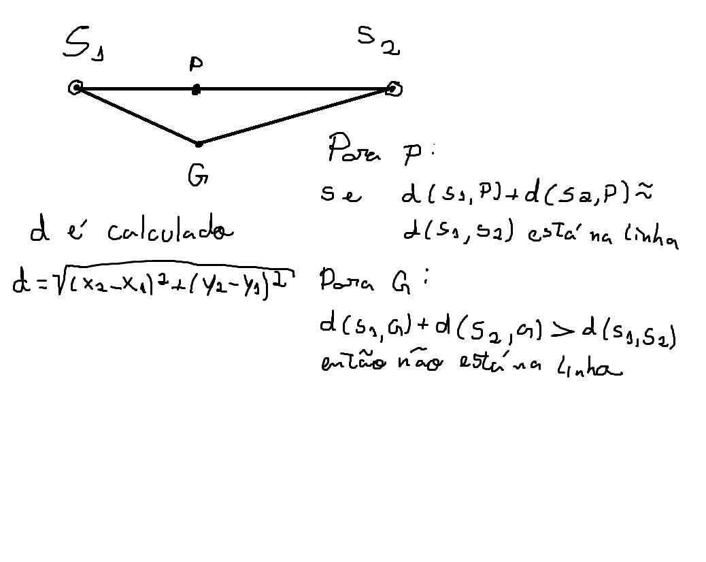

# 🔦 Simulador de Atenuação de Luz 2D (Ray Casting Engine)

Este projeto é um motor geométrico desenvolvido em C++ que simula a propagação de luz (traçado de raios) e calcula a atenuação luminosa quando os raios atravessam diversos obstáculos físicos num plano 2D. 

O sistema lê uma cena a partir de um ficheiro de texto (`regiao.txt`), processa as interseções geométricas de forma analítica e devolve a intensidade de luz final recebida em pontos-alvo específicos.

## 🚀 Funcionalidades

* **Leitura Dinâmica de Cena**: Processamento (parsing) de ficheiros `.txt` para instanciar dinamicamente fontes de luz, alvos e obstáculos.
* **Múltiplos Obstáculos Geométicos**: Suporte para interseções com Retângulos, Círculos e Linhas.
* **Atenuação Cumulativa**: Cálculo preciso da redução de intensidade luminosa com base no Fator de Redução (Reduction Factor) de cada obstáculo atravessado.
* **Arquitetura Orientada a Objetos (POO)**: Utilização extensiva de Polimorfismo (classes derivadas de `Obstacles`) e Composição (`FotonPoint` e `TargetPoint` contendo `Point`).

---

## 📐 Matemática e Algoritmos de Interseção

Para otimizar a performance e evitar simulações baseadas em passos de tempo (step-by-step), este projeto utiliza **soluções matemáticas analíticas** para detetar colisões.

### 1. Interseção Raio-Círculo (Equação Quadrática)
O cálculo de interseção com obstáculos circulares baseia-se na fusão da **Equação Paramétrica da Reta** com a **Equação Reduzida da Circunferência**. O problema é transformado numa equação do 2º grau ($at^2 + bt + c = 0$), onde o discriminante ($\Delta$) e a Fórmula de Bhaskara revelam a percentagem exata ($t$) do trajeto onde ocorre a colisão.



### 2. Interseção de Segmentos de Reta (Produto Vetorial / CCW)
Para detetar colisões entre o raio de luz e linhas/retângulos, o motor utiliza o cálculo de **Orientação via Produto Vetorial (Cross Product)**. Em vez de calcular coordenadas exatas de cruzamento, a função `ccw` (Counter-Clockwise) verifica matematicamente se os pontos de um segmento estão em lados opostos do outro segmento.



### 3. Ponto no Segmento (Desigualdade Triangular)
Para casos colineares (onde o produto vetorial é zero), o sistema valida a colisão física usando o princípio degenerado da desigualdade triangular.



---

## 📂 Estrutura de Diretórios

O projeto está organizado de forma modular para separar claramente interfaces, implementações, binários e recursos:

* **`bin/`**: Contém o executável final gerado após a compilação do projeto.
* **`docs/`**: Armazena as imagens e diagramas utilizados neste README para explicar a matemática e os algoritmos do simulador.
* **`exemplos/`**: Guarda arquivos de texto com exemplos de entradas de cenas (`.txt`) e os seus respectivos relatórios de saída esperados.
* **`include/`**: Contém todos os arquivos de cabeçalho (`.h`), que definem as interfaces públicas, classes e estruturas de dados do projeto.
* **`obj/`**: Diretório de construção (build) onde os arquivos objeto não-linkados (`.o`) gerados durante a compilação são armazenados temporariamente.
* **`src/`**: Contém os arquivos de código-fonte (`.cpp`), com a implementação real das lógicas matemáticas e arquitetura das classes.

---

## 🏗️ Arquitetura do Projeto

* `SceneParser`: Orquestrador estático responsável pelo ciclo de vida do programa (leitura do ficheiro, cálculos iterativos e formatação da saída).
* `Geometry`: *Namespace* contendo a biblioteca matemática fundamental do motor (cálculos puros).
* `Obstacles`: Classe base abstrata que define o contrato polimórfico (`countIntersections` e `printData`).
  * `Rectangle`, `Circle`, `Line`: Classes filhas que implementam a geometria específica de colisão.
* `FotonPoint` e `TargetPoint`: Entidades lógicas que utilizam *Composição* para armazenar as coordenadas no espaço (`Point`).

---

## 📄 Formato de Entrada e Saída

**Exemplo de ficheiro de entrada (`cena.txt`):**
```text
R 0 10 1 1 1 1    # Retângulo (ID, RF, X, Y, Altura, Largura)
C 1 20 5 5 5      # Círculo (ID, RF, X, Y, Raio)
F 0 100 1 1       # Fóton (ID, Intensidade, X, Y)
P 0 2 2           # Ponto Alvo (ID, X, Y)

## 🛠️ Como Compilar e Executar

Este projeto utiliza um `Makefile` para automatizar o processo de compilação. Certifique-se de ter o GCC (g++) instalado no seu sistema.

### 1. Compilando o Projeto

Abra o terminal na pasta raiz do projeto e execute o comando correspondente ao seu sistema operacional:

**Para Linux / macOS:**
```bash
make

**Para Windows (via MinGW):**
```bash
mingw32-make

### 2. Executando o Simulador
Após a compilação, um executável será gerado na pasta do projeto. Para rodar a simulação, execute o programa(certifique-se de ter o arquivo regiao.txt na raiz):

**Para Linux / macOS:**
```./simulador_luz
make

**Para Windows (via MinGW):**
```simulador_luz.exe
mingw32-make